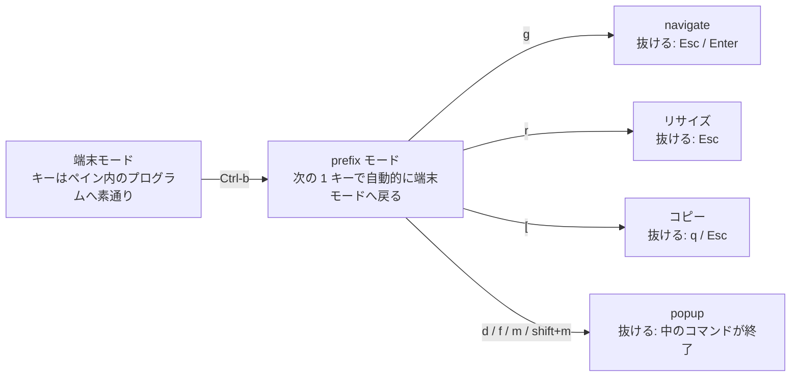

# herdr チートシート

複数の AI コーディングエージェント（codex / claude 等）を束ねる端末マルチプレクサ
[herdr](https://github.com/herdrdev/herdr) の起動・キーバインド・設定挙動のリファレンス。
単一の Rust バイナリで、tmux 級の永続セッション + エージェント状態検知 + socket API を提供する。

- **導入**: aqua で管理（`dot_config/aquaproj-aqua/aqua.yaml` の `herdrdev/herdr`）
- **設定ファイル**: `~/.config/herdr/config.toml`（chezmoi ソース = `dot_config/herdr/config.toml`）
- **prefix キー**: `Ctrl-b`（herdr デフォルト。tmux の `Ctrl-a` とは別キー。以下 `<prefix>` と表記）
- **テーマ**: Catppuccin（ghostty / nvim と統一）

> 表記: `<prefix>` = Ctrl-b。「prefix+X」は prefix を打ってから X。
> `prefix+alt+X` のような alt 併用は端末（ghostty）依存で効かない場合がある。

---

## 用語と構造（space / tab / pane）

**session > workspace(space) > tab > pane** の 4 段の入れ子。キーバインドはこの段のどれを
操作するかで分かれているので、ここを押さえるとヘルプが読める。

```
session                         herdr サーバ。デタッチしても中身は動き続ける
└─ workspace ( = space )        1 リポジトリ / 1 プロジェクト。cwd と git ブランチを持つ
   └─ tab                       その中の作業の切り口
      └─ pane                   端末 1 つ。ここでエージェントが動く
```

実際に動いている構造で書くとこうなる（`herdr workspace list` / `tab list` / `pane list` の結果）。

```
session
├─ w2P  dotfiles                      ← space（サイドバーの "spaces" に出る）
│  └─ w2P:t1  タブ 1
│     └─ w2P:p1  zsh
└─ w2Q  myapp                         ← space
   ├─ w2Q:t1  タブ 1
   │  └─ w2Q:p1  claude               ← agent として "agents" にも出る
   └─ w2Q:t2  タブ 2
      └─ w2Q:p2  zsh
```

| 概念 | サイドバー | 中身 | 作る | 移動する | ID の形 |
| --- | --- | --- | --- | --- | --- |
| **session** | — | herdr サーバそのもの | `herdr` | `<prefix> q` でデタッチ | — |
| **workspace** (= space) | `spaces` 節 | cwd + git ブランチ。タブを束ねる | `<prefix> shift+n` | `<prefix> w` ピッカー / `<prefix> g` navigate | `w2Q` |
| **tab** | space の下 | ペインのレイアウト 1 つ | `<prefix> c` | `<prefix> 1..9` / `<prefix> p` / `<prefix> n` | `w2Q:t1` |
| **pane** | — | 端末 1 つ | `<prefix> v` / `<prefix> -` | `<prefix> h/j/k/l` | `w2Q:p1` |
| **agent** | `agents` 節 | pane で検出された AI CLI | pane で `claude` 等を起動 | `<prefix> g` | （pane に付く） |

> **pane の番号は tab ではなく space 単位**。`w2Q:t2` の中の pane が `w2Q:p2` になっている
> とおり、`p` の採番は space 全体で通し。ID を見れば「どの space の何番か」が分かる。

**自分が今どこにいるかは環境変数で分かる。** 各 pane には herdr が以下を入れている。

```sh
echo "$HERDR_WORKSPACE_ID / $HERDR_TAB_ID / $HERDR_PANE_ID"   # 例: w2Q / w2Q:t1 / w2Q:p1
```

> **用語の揺れに注意**: 設定ファイルとヘルプは `workspace`、サイドバーの見出しと
> `agent_panel_sort` は `space` と呼ぶ（`"workspaces"` は `"spaces"` の別名として受理される）。
> **同じものを指している。**

---

## 起動・セッション

| コマンド | 動作 |
| --- | --- |
| `herdr` | 永続セッションを起動 / アタッチ（サーバが無ければ起動） |
| `herdr --session <name>` | 名前付きセッションを起動 / アタッチ |
| `herdr session attach <name>` | 既存の名前付きセッションへ復帰 |
| `herdr --remote <ssh-target>` | リモートホストのセッションへ SSH 経由でアタッチ（切断耐性・接続多重化つき） |
| `herdr status` | ローカルクライアントと稼働中サーバの状態表示 |
| `herdr server reload-config` | 起動中サーバへ `config.toml` を再読込 |
| `herdr server stop` | サーバ停止（API ソケット経由） |
| `herdr update` | 最新版をダウンロードして更新 |
| `herdr completion zsh` | zsh 補完を生成 |
| `herdr config check` | `config.toml` を検証して診断を表示 |
| `herdr config reset-keys` | `config.toml` をバックアップしてカスタムキーを除去 |

> `reset-keys` は `[keys]` / `[keys.indexed]` / `[[keys.command]]`（`<prefix> d` / `<prefix> f` の
> popup を含む）をまとめて除去する。誤って実行しても `chezmoi apply` で chezmoi ソース側の
> `config.toml` を再展開すれば復元できる。

---

## 入力モード（どのキーが、いつ効くのか）

herdr のキーは**そのときのモードでしか効かない**。ヘルプに並ぶキーが「今」押せるとは限らないので、
まずモードを押さえる。



> この図は**モード間の行き来**だけを示す。各モードの中で効くキーは下の表を見ること。
> mermaid は GitHub の web 表示と `mo` では描画されるが、**`glow` では生のコードブロックとして
> 出る**（[Markdown プレビュー](markdown-preview-cheatsheet.md)）。

| モード | 入り方 | 抜け方 | そこで効くキー |
| --- | --- | --- | --- |
| **端末モード**（通常） | 既定の状態 | — | キーはペイン内のプログラムへ素通り。herdr が横取りするのは直接コード（`ctrl+alt+h` 等）だけ |
| **prefix モード** | `Ctrl-b` | 次の 1 キーで自動的に抜ける | 下の一覧。`<prefix> ?` のヘルプもここ |
| **navigate（goto）** | `<prefix> g` | `Esc` / `Enter` | `↑`/`↓` で space、`h`/`j`/`k`/`l` でペイン（`←`/`→` は常に左右ペイン）。`[keys]` の `navigate_*` が**このモード中だけ** `focus_pane_*` より優先される |
| **リサイズ** | `<prefix> r` | `Esc` | `h`/`l` で幅、`j`/`k` で高さ |
| **コピー** | `<prefix> [` | `q` / `Esc` | `h/j/k/l`・`w/b/e`・`{`/`}`・`PageUp/Down`・`Ctrl-b`/`Ctrl-f`・`Ctrl-u`/`Ctrl-d` で移動。`/` `?` で検索し `n` `N` で送る。`v`/`Space` で選択、`y`/`Enter` でコピー |
| **popup** | `<prefix> d` / `f` / `m` / `shift+m` | 中のコマンドの終了（`q`。`m` はファイルを選び終わった時点） | **全ての入力が中のアプリへ行く**。herdr のキーは一切効かない |

> コピーモードは**ペインを止めない**（出力は流れ続ける）。マウスのドラッグ選択なら
> コピーモードに入らずにコピーできる。

---

## ヘルプ（`<prefix> ?`）の見方

**herdr の全アクションの一覧**で、このリポジトリの設定に限った表ではない。グループは
「何を操作するか」で分かれている。

| グループ | 対象 |
| --- | --- |
| `global` | herdr 全体（prefix mode / detach / reload config / 通知） |
| `navigation` | 移動系のピッカーとモード（workspace list / session navigator など） |
| `workspaces / tabs` | space・タブ・worktree・エージェントの作成 / 切替 / 削除 |
| `panes` | ペインの分割・移動・リサイズ・ズーム・コピーモード |
| `custom` | `[[keys.command]]` で自分が足したもの（下記） |

**多すぎて探せないときは `/` を押す**。アクション名でもショートカットでも絞り込める
（`Backspace` で編集、`Ctrl-U` でクリア）。

**キーが表示されていない項目は「未割当」**。herdr は既定で割り当てていないアクションも一覧に
並べるため、載っている＝押せる、ではない。既定で未割当なのは以下（`herdr --default-config` で
値が `""` のもの）。

`switch workspace 1-9` / `previous workspace` / `next workspace` / `previous agent` / `next agent` /
`focus agent 1-9` / `open worktree` / `delete worktree checkout` / `last pane`

> 紛らわしい組み合わせ: **`<prefix> 1..9` は `switch tab 1-9`**（タブ切替）。すぐ隣に並ぶ
> `switch workspace 1-9` は別アクションで、既定では未割当。space を番号で切り替えたいなら
> `[keys]` の `switch_workspace` に明示的に割り当てる必要がある。

---

## キーバインド（prefix モード）

いずれも `<prefix>` を打ってから続けて押す。ヘルプと同じ並びで、**既定で割り当て済みのもの**を挙げる。

| キー | 動作 | グループ |
| --- | --- | --- |
| `<prefix> ?` | ヘルプ | global |
| `<prefix> s` | 設定 | global |
| `<prefix> q` | デタッチ（セッションは生かしたまま抜ける） | global |
| `<prefix> shift+r` | config 再読込 | global |
| `<prefix> o` | 通知の対象を開く | global |
| `<prefix> w` | ワークスペース（space）ピッカー | navigation |
| `<prefix> g` | goto ピッカー（navigate モードに入る） | navigation |
| `<prefix> shift+n` | 新規ワークスペース | workspaces / tabs |
| `<prefix> shift+w` | ワークスペース名変更 | workspaces / tabs |
| `<prefix> shift+d` | ワークスペースを閉じる | workspaces / tabs |
| `<prefix> shift+g` | 新規 git worktree | workspaces / tabs |
| `<prefix> c` | 新規タブ | workspaces / tabs |
| `<prefix> shift+t` | タブ名変更 | workspaces / tabs |
| `<prefix> p` / `<prefix> n` | 前 / 次のタブ | workspaces / tabs |
| `<prefix> 1..9` | **タブ**を番号で切替 | workspaces / tabs |
| `<prefix> shift+x` | タブを閉じる | workspaces / tabs |
| `<prefix> v` | ペインを縦分割 | panes |
| `<prefix> -` | ペインを横分割 | panes |
| `<prefix> x` | ペインを閉じる | panes |
| `<prefix> shift+p` | ペイン名変更 | panes |
| `<prefix> z` | ペインをズーム（全画面トグル） | panes |
| `<prefix> h/j/k/l` | 左/下/上/右のペインへフォーカス | panes |
| `<prefix> shift+h/j/k/l` | ペインを入れ替える | panes |
| `<prefix> tab` / `<prefix> shift+tab` | 次 / 前のペインへ巡回 | panes |
| `<prefix> r` | リサイズモード | panes |
| `<prefix> [` | コピーモード | panes |
| `<prefix> e` | スクロールバックを編集 | panes |
| `<prefix> b` | サイドバーの表示トグル | panes |

> **`herdr --default-config` の雛形は全アクションを網羅していない。** コピーモード
> （`copy_mode`）・ペイン入れ替え（`swap_pane_left/down/up/right`）・タブ移動
> （`move_tab_previous` / `move_tab_next`）は雛形に項目が無いが実在する（`herdr config check`
> が設定キーとして受理することで確認）。上表の `<prefix> [` と `<prefix> shift+h/j/k/l` は
> herdr 公式ドキュメント（0.8.x）記載の既定値で、雛形から確認できないぶん**実測はしていない**。
> **実際に効くキーの正解はヘルプ（`<prefix> ?`）**。雛形は「設定できる項目のうち主要なもの」に
> 過ぎない。

---

## カスタムコマンド（popup）

`[[keys.command]]` で割り当てた外部 TUI。`type = "popup"` はタブ/ペイン構成を変えない
セッションモーダル端末で、閉じれば元のレイアウトに戻る。**フォーカス中ペインの作業ディレクトリ**で
起動するので、エージェントを動かしているペインから押せばそのリポジトリのまま開く。

| キー | 動作 |
| --- | --- |
| `<prefix> d` | gitui を popup で開く（差分確認・hunk 単位のステージング・コミット） |
| `<prefix> f` | yazi を popup で開く（プレビュー付きファイラ。テキストファイルは `Enter` で `$EDITOR`(=nvim)） |
| `<prefix> m` | md を選んで `mo` に渡す（**ブラウザ**で開く。mermaid・全文検索・保存即反映が要るとき。選択 UI は `Tab` で複数選択、`Ctrl-R` は選ばずにタブを開き直す、`Ctrl-G` は `.gitignore` 対象も出す） |
| `<prefix> shift+m` | glow を popup で開く（**端末内**の markdown ビューア。ペインを見ながらざっと読む用） |

**閉じ方**: popup は**中のコマンドが終了したときだけ**閉じる（gitui / yazi / glow とも `q`）。
popup は Escape を含む全ての入力を中のアプリへ渡すため、herdr 側に「popup だけ閉じる」キーは無い。
`<prefix> m`（mo）だけは例外的に**ファイルを選び終わると自動で閉じる** — 中で動くのは選択 UI だけで、
表示そのものはブラウザへ出るため（`Esc` で何も選ばずに閉じてもよい）。詳細は
[Markdown プレビュー チートシート](markdown-preview-cheatsheet.md)。

`<prefix> m` の一覧は既定で `.gitignore` などの**無視設定に従う**ので、`.superpowers/` や
`docs/superpowers/` に溜まるエージェントの作業ログは出ない。**`Ctrl-G`** で無視設定を外した一覧と
行き来できる（もう一度押すと戻る。今どちらかはプロンプトの `[全件]` で分かる）。常に全件にしないのは、
`.terraform/modules` や `node_modules` の README を数百件抱えるリポジトリがあるため。

**yazi 内のキー（popup 内で押す）**: `Enter` は従来どおり popup の**内側**で `$EDITOR`(=nvim) を開く（サッと見る用）。
一方 `e` はカーソル中のファイルを **herdr の新規タブ**で起動した nvim で開く（腰を据えて編集する用）。
`e` は橋渡しスクリプト `~/.local/bin/herdr-edit` を呼び、herdr socket API（`tab create` → `pane run`）で
新規タブに nvim を立てる。yazi 自体は開いたまま残るので、`e` の後に `q` で yazi を閉じると
フォーカス済みの nvim タブが前面に出る（popup はモーダルなので新規タブは popup の裏に作られるため）。

`shell` には **`--block` を付けている**。既定の非ブロッキング実行は `herdr-edit` の stderr を握り潰すため、
失敗しても画面には `1 left` のタスクが残るだけで「`e` が無反応」に見えてしまう（理由を読むには `w` →
`Enter` でタスクログを開く必要があり、`q` では unfinished task の警告になる）。`--block` なら端末を
`herdr-edit` へ渡すのでエラー（herdr の生の応答つき）がその場に出て、`[Enter] で元の画面に戻ります…` で
止まって読める。成功時は herdr へ 2 往復するだけなので体感は変わらない。なお `--block` した子プロセスの
**stdout は yazi が「移動先の cwd」として解釈する**ので、`herdr-edit` は stdout に何も出さず、herdr の
応答 JSON はコマンド置換で受け取っている。

**yazi の設定**: `dot_config/yazi/yazi.toml`（→ `~/.config/yazi/yazi.toml`）で
`[mgr] show_hidden = true` にしており、dotfiles を扱うため隠しファイルを最初から表示する。
yazi 内で `.` を押せば一時的にトグルできる。
キーマップは `dot_config/yazi/keymap.toml`（→ `~/.config/yazi/keymap.toml`）で `[[mgr.prepend_keymap]]`
により既定を温存したまま `e`（= `herdr-edit` で新規タブの nvim）を追加している。Yazi のファイル指定は
プレースホルダで、`%h` がカーソル中ファイル・`%s` が選択ファイル（`$@` ではない）。
プレビューの MIME 判定に `file(1)` を使うため、Linux では `file` パッケージが要る
（`.chezmoiscripts/run_onchange_before_10-install-packages.sh.tmpl` で導入。macOS は標準搭載）。
無いと `cannot find 'file' to detect the file's MIME type` が出てプレビューが表示されない。

> gitui / yazi は aqua 管理（`dot_config/aquaproj-aqua/aqua.yaml`）。
> `prefix+alt+X` 形式は ghostty 依存で効かないことがあるため単一キーにしている。

> popup コマンドは `/bin/sh -c` で実行され、環境変数は**herdr サーバ起動時のもの**を継承する。
> したがって `EDITOR` 等を変えても `herdr server reload-config` / `<prefix> shift+r` では
> popup 側に反映されず、`herdr server stop` からの再起動が要る。

---

## 設定挙動（`config.toml` で有効化している項目）

デフォルトから変更 / 有効化しているのは以下。ファイル内では該当行に `# ← 設定` を付けている。

| 設定 | 値 | 目的 |
| --- | --- | --- |
| `onboarding`（トップレベル） | `false` | 初回ウィザードを出さない。聞かれるのは通知の出し方で、それは下の `[ui.toast] delivery` で決めているため |
| `[theme] name` | `catppuccin` | 端末(ghostty)・nvim と配色を統一。ghostty は固定ダークなので `auto_switch` は未使用 |
| `[ui.toast] delivery` | `system` | 背景エージェントの状態変化（要対応/完了）を macOS 通知センターへ。初回は OS の通知許可が必要 |
| `[experimental] switch_ascii_input_source_in_prefix` | `true` | prefix モード中だけ ASCII 配列へ一時切替し、抜けたら元へ戻す（日本語 IME 有効のまま prefix を取りこぼさない。macOS 専用） |
| `[experimental] reveal_hidden_cursor_for_cjk_ime` | `true` | claude/codex など自前カーソル描画の TUI でも IME 候補ウィンドウが追従する |
| `[experimental] cjk_ime_agents` | `["claude","codex","kiro"]` | カーソル追従を実際に使うエージェントに限定 |
| `[[keys.command]]` | `<prefix> d` = gitui / `<prefix> f` = yazi | 差分確認とファイル探索を popup で。nvim を開かずサッと見る用（詳細は上の「カスタムコマンド（popup）」） |

> **`onboarding` をわざわざ書いている理由**: herdr はウィザードで選ばせたあと
> `~/.config/herdr/config.toml` へ `onboarding = false` を**自分で書き戻す**。ソース側が
> 未記述だと `chezmoi apply` がその行を消し、**キーが無い状態は「表示する」と同じ扱い**
> （雛形の `Missing also shows onboarding`）なので、`chezmoi update` のたびに差分が出て
> ウィザードも復活する。`.chezmoiignore` や `create_` で逃げると雛形の更新を配れなくなるため、
> ソースに値を明示する。

> 反映は `herdr server reload-config` または `<prefix> shift+r`。検証は `herdr config check`。
> `~/.config/herdr/` 内の `session.json` / `*.log` / `release-notes.json` は**実行時の状態ファイル**で、
> chezmoi ソースには含めない（管理対象は `config.toml` のみ）。

---

## エージェント状態 integration（claude / codex）

サイドバーの状態表示（作業中 / 要対応 / 完了）と `[ui.toast] delivery=system` の通知精度を上げるため、
各エージェントに herdr 公式フックを入れている。無くても端末出力ヒューリスティックで推定は効くが、
フックからの報告の方が正確で、codex⇄claude 相互レビューで片方が止まったのを取りこぼしにくい。

**chezmoi で自動導入**している（手動で `herdr integration install` を叩く必要はない）:

- `.chezmoiscripts/run_onchange_after_45-herdr-integration.sh.tmpl` が `chezmoi apply` 時に
  `herdr integration install claude` / `... codex` を実行する。install が書くのは以下（**chezmoi 管理外**・
  herdr がバージョン管理する実行時ファイル）:
  - claude: `~/.claude/hooks/herdr-agent-state.sh`（フック本体・マシン固有パスなしのポータブル）
  - codex : `~/.codex/herdr-agent-state.sh` + `~/.codex/hooks.json` + `config.toml` に `hooks = true`
- 例外は **claude の `~/.claude/settings.json` への `SessionStart` hook 追記**。これは chezmoi 管理ファイル
  （`private_dot_claude/modify_settings.json.tmpl`）と衝突するため、hook エントリを**ソース側に焼き込んでいる**
  （パスは `{{ .chezmoi.homeDir }}` でテンプレート化）。ソースは herdr 出力と byte 一致（キー順そのまま・
  末尾改行なし）にしてあり、install は冪等に上書きするだけなのでドリフトしない。

| コマンド | 動作 |
| --- | --- |
| `herdr integration status` | 各エージェントのフック導入状況・バージョンを表示 |
| `herdr integration status --outdated-only` | herdr 更新でフック版が古くなったものだけ表示 |
| `herdr integration install <agent>` | フックを導入 / 最新版へ更新（claude/codex/pi/… 対応） |
| `herdr integration uninstall <agent>` | フックを除去 |

> herdr 本体を更新してフック版が上がったとき（`status --outdated-only` に出る）は、
> `run_onchange_after_45-herdr-integration.sh.tmpl` 内の `herdr-integration-marker:` の日付を書き換えると
> 既存マシンでも `chezmoi apply` で再導入されて最新版に揃う。

---

## 旧 `ide` 関数との関係

`ide`（`dot_config/zsh/rc.d/50-functions.zsh`）は nvim を土台に codex(左) + claude(右) + terminal(下)
を並べ、agmsg で相互レビューさせる「AI エージェントの実行土台」だった（エディタは主に差分確認用）。
その **多重化 + 永続化** の役割は herdr がネイティブに置き換えられる。

| ide での実現手段 | herdr での代替 |
| --- | --- |
| shpool による SSH 切断耐性ラッパー | herdr の永続セッション（サーバ常駐） + `herdr --remote` |
| `claude --remote-control`（モバイル操作） | `herdr --remote <ssh-target>` でセッションへアタッチ。加えて SSH 接続先で引数なしの `claude` は zsh ラッパー（`50-functions.zsh`）が `--remote-control` を自動付与する |
| ide.lua の codex/claude/terminal パネル配置 | `<prefix> v` / `<prefix> -` で分割し、各ペインで `codex` / `claude` を直接起動 |
| 非フォーカス端末の追従スクロール自作 | herdr のペイン管理・サイドバーで状態を把握 |
| nvim ide.lua の CJK IME 回避（SIGUSR1/Resync 等） | `[experimental]` の CJK IME オプション |
| 狭画面フォールバック（iPad/Termius） | `[ui] mobile_width_threshold` によるモバイル 1 カラムレイアウト |

差分確認には 2 つのルートがある。**サッと見る**なら `<prefix> d` の gitui popup（レイアウトを
壊さず、閉じれば元に戻る）。**腰を据えて読む / その場で直す**ならペインで `nvim` を開き、
neo-tree の Git タブから diffview へ（`docs/nvim-cheatsheet.md`）。ファイル探索も同様に、
`<prefix> f` の yazi popup と nvim の neo-tree / fzf-lua を用途で使い分ける。

---

## 走行中の claude が AWS 認証切れを踏むと `AWS login:` タブが開く

herdr は再接続してもエージェントを起動し直さないので、走り続けている `claude`（`claude-bedrock`
で起動したもの）の AWS 認証が期限切れになることがある。このとき **`AWS login: <profile>` という
タブが自動で開き、フォーカスがそこへ移る**（herdr の通知も出る）。開いたタブで `aws-auth-ensure` が
走るので、案内に従ってログインすればよい。

- **claude を起動し直す必要はない。** 認証が通れば次のツール呼び出しから復帰する。
- タブは 1 枚しか開かない。閉じてから 60 秒は開き直さない。
- 認証が済んだら、そのタブは `<prefix> x` で閉じてよい。
- 期限切れは Claude Code の statusLine にも `⚠ AWS 未認証: <profile>` として出る。

これが起きるのは `AWS_LOGIN_NO_INTERACTIVE` が立っている配下だけ。**ペインで普通に `aws s3 ls` を
叩いて期限切れになった場合は、そのペインでそのままログインが走る**（タブは開かない）。仕組みは
[aws-cheatsheet.md](aws-cheatsheet.md#走行中に認証が切れたとき)。

---

## SSH 異常切断後の端末化け（`term-reset`）

`herdr --remote <ssh-target>` で接続中に SSH が異常切断（`client_loop: send disconnect:
Broken pipe` 等）されてローカルターミナルに戻ると、リモートの nvim 等が有効化した端末モードの
解除シーケンスがローカルへ届かず居残り、端末が化ける:

- **Kitty keyboard protocol（CSI u）の残置** → キー入力ごとに `15;1:3u` / `01;1:3u` のような
  生エスケープが漏れて表示される（`:3` はキーリリースイベント）。
- **マウス報告（SGR mouse mode）の残置** → クリック / スクロールで `0;129;39M` が出る。

対策として `dot_config/zsh/rc.d/50-functions.zsh` に `term-reset` 関数を置き、ローカルの
`herdr` / `ssh` を zsh 関数でラップして**戻り際に必ず `term-reset` を呼ぶ**。`term-reset` は
マウス報告・フォーカス報告・括弧付き貼り付けを無効化し、`\e[<u` で Kitty keyboard スタックを
pop、`\e[=0;1u` で現行フラグを 0 に戻す（素の端末で叩いても無害なので、化けたときは手動で
`term-reset` と打っても復旧できる）。herdr は内部で自前の ssh を exec するため、`ssh` ラッパー
だけでは herdr 経由の切断を拾えず、`herdr` 自体もラップしている。リモートシェル
（`$SSH_CONNECTION` あり）ではラッパーを定義しない。

> **経緯**: この `term-reset` + ラッパーは元々 `ide`（shpool）ワークフロー用に存在したが、
> 上記の ide 撤去（`11f40d3`）で一緒に消えた。端末状態のリークは多重化の実装（shpool→herdr）
> とは独立した問題で、herdr でも SSH 異常切断で同じ化けが再発するため、ラップ対象を `ssh` に
> 加えて `herdr` へ広げる形で復活させた。

---

## herdr が固まり、そのホスト宛の ssh が全部ハングする（pty プロキシ起因の ControlMaster デッドロック）

`herdr` を起動すると **UI の一部だけ描画されて、シェルも出ず、キー入力も `<prefix> q` も一切
効かない**。さらにそのあと、別の端末から `ssh develop-server` も `ssh -O check` も `ssh -O exit`
も**永久にハングする**。`ssh -o ControlPath=none develop-server` だけが繋がり、そのとき
`bind [127.0.0.1]:55887: Address already in use` と
`remote port forwarding failed for listen path /run/user/<uid>/portfwd.sock` が出る
（逆チャネルが TCP だった頃は `listen port 55999`）。Ghostty を落とすと直る。

原因は herdr でも ssh でもなく、**Ghostty とシェルの間に挟まっている pty プロキシ**にある。
Kiro CLI のシェル統合は `kiro-cli-term`（Fig 由来の figterm）でシェルを内側の pty に包み直す。
これが TUI の大量出力（herdr の初期再描画）で内側 pty から読むのをやめると、次の連鎖でホスト宛の
ssh が丸ごとデッドロックする:

1. `kiro-cli-term` が内側 pty のマスタ側を読まない → **内側 pty の出力キューが満杯**
2. ssh クライアントが stdout に書けない → mux socket を読むのをやめる
3. **ControlMaster が mux socket への `write()` でブロック**し、イベントループから出られなくなる
4. master がネットワークを読まない（受信バッファが満杯のまま張り付く）／control socket も
   accept しない
5. 以降の `ssh` / `-O check` / `-O exit` は `~/.ssh/cm-<host>` に繋いだまま永久に待つ
   （`-o ControlPath=none` だけが迂回できる。bind エラーは固まった master が
   55887 と逆チャネルのソケットを握り続けているため）

**TCP は生きている**ので `ServerAliveInterval` は効かない。ssh は keepalive を送る／評価する
イベントループにそもそも入れていない。

**切り分け**。サーバ側が無実であることは別セッションから確認する（応答すればサーバもペインも
生きている）:

```bash
herdr status && herdr tab list
```

ローカル側は次で確定させる。master が `write` でブロックし、TCP の Recv-Q が受信バッファ上限
（rhiwat）に張り付いていれば、この節の症状:

```bash
ps -o pid,stat,command -ax | grep '[c]m-'          # ssh: ~/.ssh/cm-<host> [mux] の pid
sample <mux-pid> 1 -f /tmp/m.txt                   # 全サンプルが write(2) なら master はブロック中
netstat -anv -p tcp | grep '\.22 '                 # Recv-Q が rhiwat に張り付いていれば読んでいない
netstat -an -f unix | grep cm-<host>               # Recv-Q 12 の行＝未 accept のまま溜まった ssh
```

詰まっている pty は**そこへ 1 バイト書いてみる**のが決定的。ブロックすれば出力キューが満杯:

```bash
ps -o tty= -p <ssh-pid>                            # 例: ttys004
( printf '\r' > /dev/ttys004 ) & sleep 2; kill -0 $! 2>/dev/null && echo BLOCKED
```

**復旧**は `kiro-cli-term` を落とす。連鎖が解けて master はその場で正常化し、リモートの herdr
セッションもそのまま残る（そのタブのシェルは道連れになるのでタブは閉じる）:

```bash
ps -o pid,tty,command -ax | grep '[k]iro-cli-term'
kill <kiro-cli-term-pid>
ssh -O check develop-server                        # Master running (pid=...) が即返れば復旧
```

**恒久対策**として Kiro CLI のシェル統合を無効化してある
（`.chezmoiscripts/run_onchange_after_40-ai-assistants.sh.tmpl`）:

```bash
kiro-cli integrations uninstall -s dotfiles        # rc の pre/post ブロックを削除（冪等）
kiro-cli _ local-state shell-integrations.enabled  # → false（再注入されても pre は何もしない）
```

インライン補完は失われるが、`kiro-cli chat` などは従来どおり使える。

`HERDR_LOG` でクライアント／サーバのログレベルを上げられる（既定は `herdr=info`）:

```bash
HERDR_LOG=herdr=debug herdr
```

---

## herdr を更新した後に CLI がエラーになる（protocol mismatch）

aqua で herdr のバージョンを上げても、**すでに常駐しているサーバは古いバイナリのまま**動き続ける。
CLI とサーバの socket プロトコルが食い違うと `herdr` のサブコマンドが軒並み失敗し、socket API に
依存する機能（yazi の `e` = `herdr-edit` など）が動かなくなる:

```
$ herdr tab list
{"id":"cli:tab:list","error":{"code":"protocol_mismatch","message":"client protocol 20 is newer than
server protocol 17; restart the Herdr server before using this command. ..."}}
```

**確認**: CLI とサーバの版を突き合わせる。`ps` に出るパスが aqua の pkgs 実体なので、そこから版が読める。

```bash
herdr --version                                  # PATH 上の CLI（= aqua.yaml のピン）
ps -eo pid,lstart,cmd | grep '[h]erdr.*server'   # 常駐サーバの起動時刻と実体パス
```

**対処**: サーバを止めて起動し直す。**再起動は全ペインのプロセスを終了させる**（動かしているエージェントも
含む）ので、区切りのいいところで行う。

```bash
herdr server stop
herdr   # 起動し直す
```

`herdr tab list` が JSON の結果を返せば復旧。`herdr server reload-config` / `<prefix> shift+r` は
設定の再読み込みだけでバイナリは入れ替わらないため、この症状には効かない。
